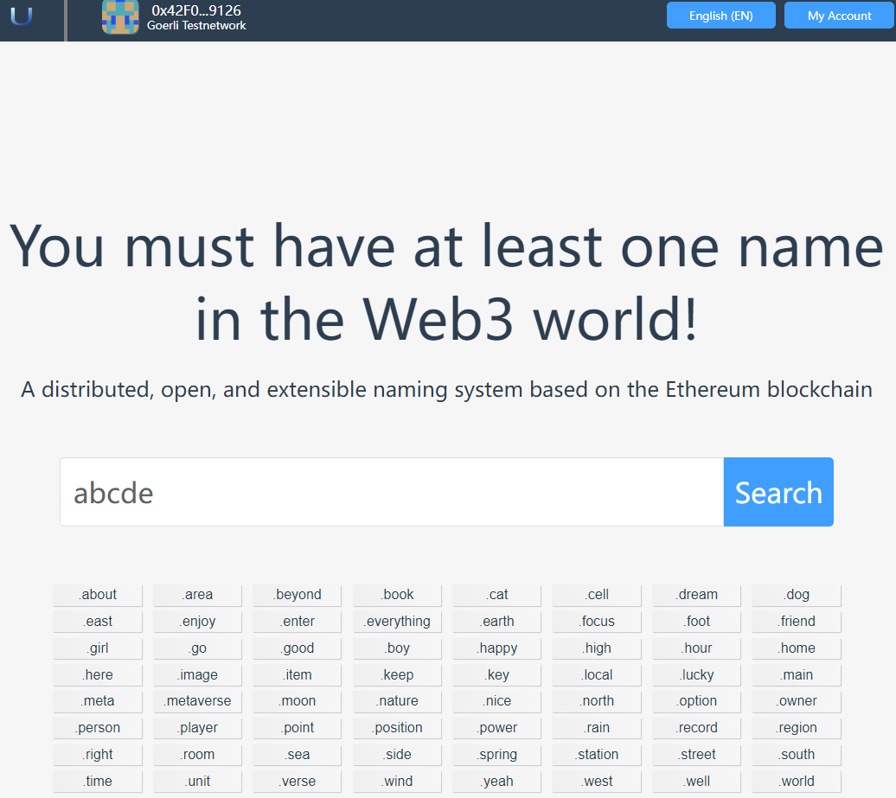
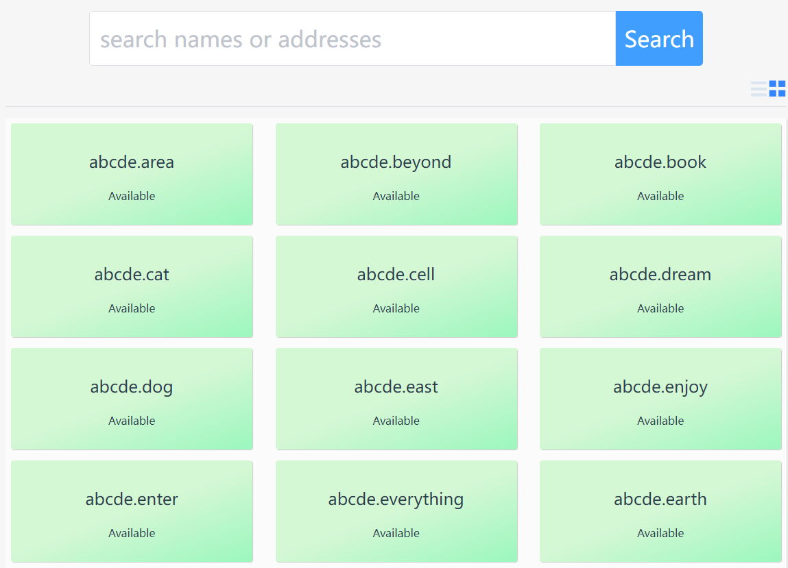
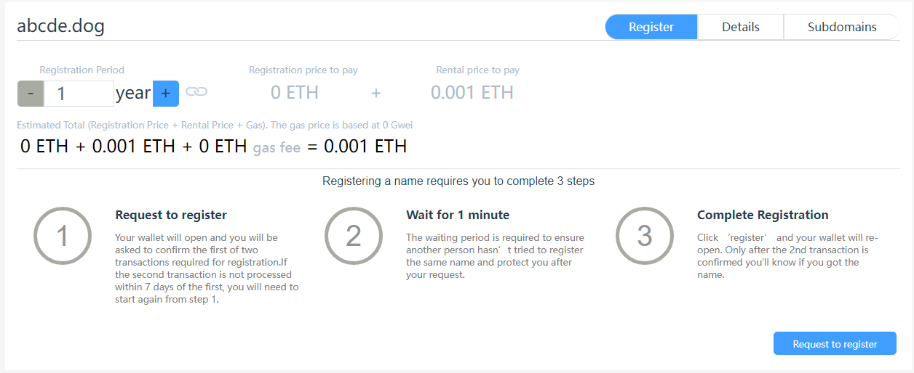
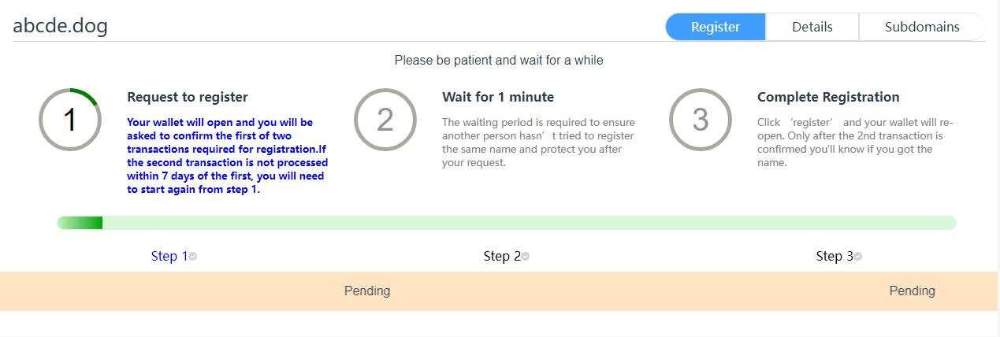
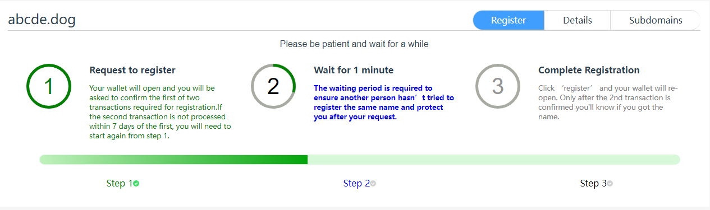
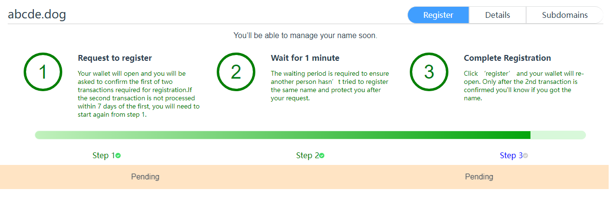
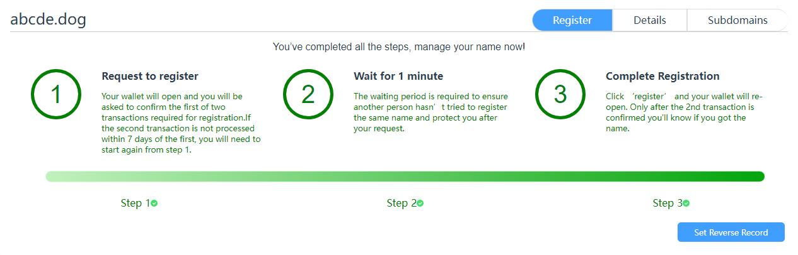

# Domain Name Registration

Domain name registration is a very important part of the app. Only after you register a domain name can you use the domain name to complete operations such as transfers and configuration files.

## 1. Find the domain name you are interested in

Use the search bar to find out whether the domain name you are interested in is available for registration. App provides a wealth of top-level domain names for you to use in different scenarios.

**In order to prevent the domain name you are interested in from being registered by others, please register the domain name you are interested in as soon as possible.**

- In the query input box on the home page, enter the domain name you are interested in, and then click the "Query" button.

- Now go to the query result page.

- On the query result page, you can switch the display mode, and you can display the query results in the form of a list or an item.
  - The green background means that the domain name can be registered. In order to prevent the domain name from being preempted by others, please register the domain name you are interested in as soon as possible.
  - A gray background means that the domain name has been preempted by others, and you can only preempt it after the domain name expires.
  - Now you click on a domain name that has not been registered to enter the registration page.

## 2. Register domain name

Similar to ENS, domain name registration requires three steps: request registration, wait one minute, and register.

### 2.1 Request for registration

Send a request to the registry to register a domain name.
Click the "Request Registration" button, the program will pop up the Metamask interface, asking the user to confirm.

**Note: This step requires the user to pay for GAS fees**

The purpose of this step is to declare to the registry that you want to register a domain name.

If you do not register within 24 hours of completing this step, you will need to return to this step to request registration again. Therefore, in order to ensure that your domain name is not squatted by others, please perform the following steps as soon as possible after this step is completed.

### 2.2 Wait for one minute

Wait for a while to make sure you don't conflict with other people's requests.

The purpose of this step is to ensure that other people are not trying to register the same name, and it is also to protect your registration request from replacing or pre-registering others.

### 2.3 Registration

After completing the registration, after paying the registration fee and rental fee, add the registration information in the registration center. After the registration is successful, the domain name belongs to you, and then you can manage the domain name.

**Note: This step requires the user to pay for GAS fees**

### 2.4 Complete registration

After completing the registration, reverse resolution can be set.

