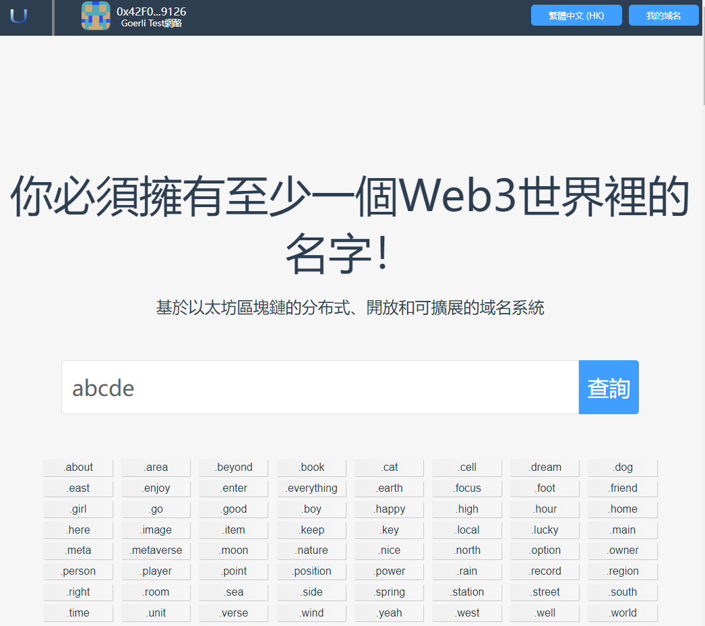
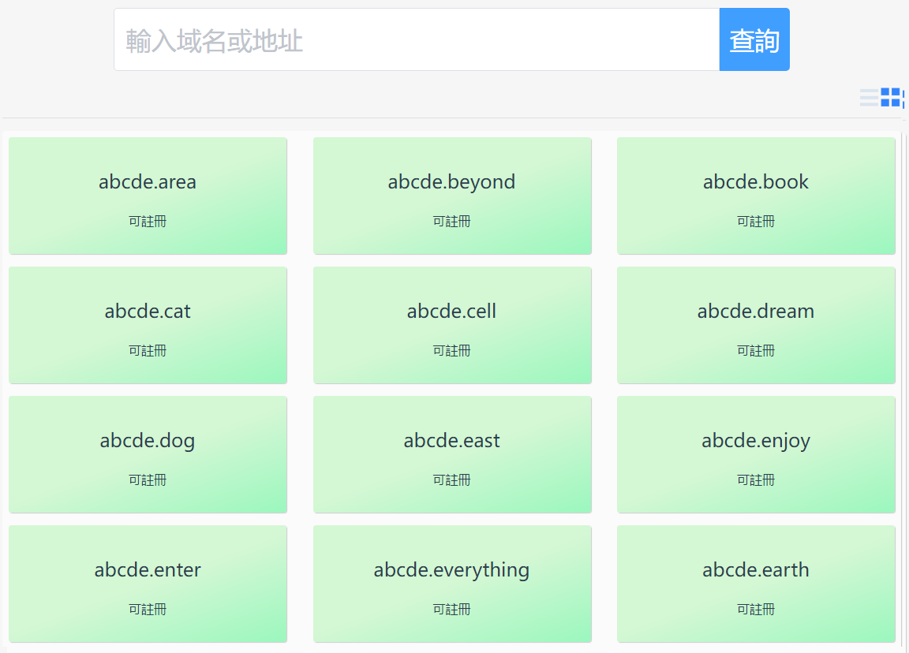
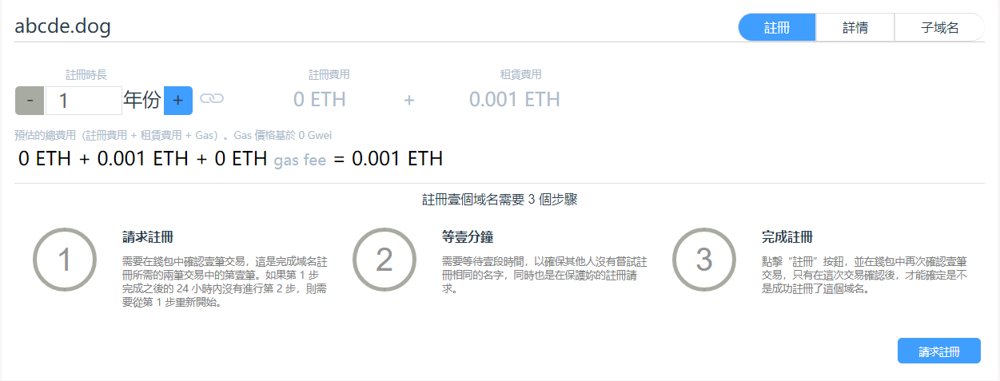
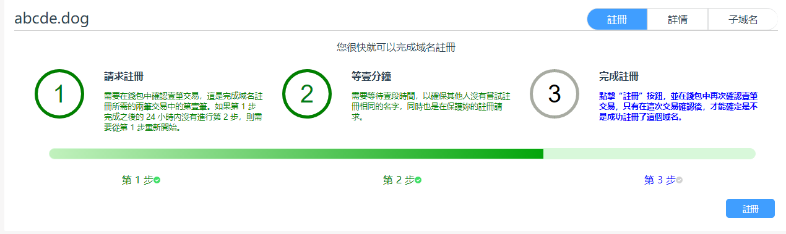
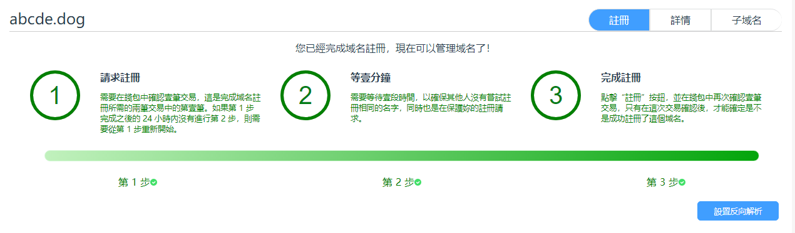

# 域名註冊

域名註冊是App中非常重要的一個部分，只有您註冊了域名，才能夠使用該域名完成轉賬、配置文件等操作。

## 1.找到感興趣的域名

通過搜索欄可以找到您感興趣的域名是否可以註冊。 App提供了豐富的頂級域名，供您在不同場景使用。

**為了防止您感興趣的域名被別人註冊，請盡快註冊您感興趣的域名。 **

- 在首頁查詢輸入框中，輸入您感興趣的域名，然後點擊"查詢"按鈕。

- 現在進入到查詢結果頁面。
 

- 在查詢結果頁面，您可以切換顯示方式，可以以列表或者條目的方式展示查詢結果。
  - 綠色背景表示該域名可以註冊，為了防止域名被別人搶注，請您盡快註冊您感興趣的域名。
  - 灰色背景表示該域名已經被別人搶注了，您只有等該域名過期後才能搶注。
  - 現在您點擊還沒有註冊的域名，進入註冊頁面。

## 2.註冊域名

同ENS類似，域名註冊需要三個步驟：請求註冊、等待一分鐘和註冊。

### 2.1請求註冊

向註冊中心發出請求，請求註冊一個域名。
點擊“請求註冊”按鈕，程序會彈出Metamask界面，要求用戶進行確認。

**注意：此步需要用戶支付燃料費**

此步的目的是向註冊中心進行聲明，告訴註冊中心您想要註冊一個域名。

如果該步驟完成之後的24小時內您沒有進行註冊，則需要回到該步驟重新開始請求註冊。因此，為了確保您的域名不被別人搶注，請在該步驟完成之後儘快執行後面步驟。

### 2.2等待一分鐘

等待一段時間，確保不和其他人的請求衝突。

此步目的是確保其他人沒有嘗試註冊相同的名字，同時也是在保護您的註冊請求，不會對其他人頂替或提前註冊。

### 2.3註冊

完成註冊，在支付了註冊費和租賃費等費用後，在註冊中心添加註冊信息。當註冊成功後，此域名就屬於您了，接下來您就可以對該域名進行管理。

**注意：此步需要用戶支付燃料費**

### 2.4完成註冊

完成註冊後，可以設置反向解析。

