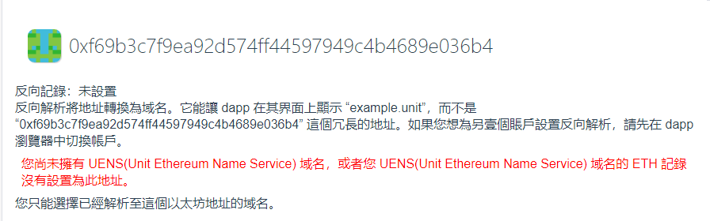
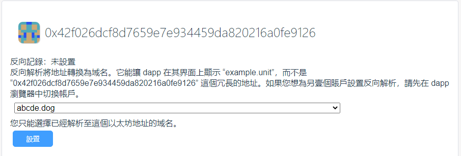

# 反向解析

同互聯網類似，反向解析指的是從ETH地址到域名的映射。

反向解析能夠將ETH地址轉換為域名，即在App中將形如“0xf69b3c7f9ea92d574ff44597949c4b4689e036b4”的冗長地址顯示為“example.unit”。

## 只能選擇解析至用戶ETH地址的域名

如果用戶未擁有域名，或者域名下的ETH記錄沒有設置為用戶的ETH地址，則不能設置反向解析記錄，如下圖所示。

## 設置反向記錄
如果您擁有域名，或者某個域名下的ETH記錄設置為您的ETH地址，則可以設置反向解析記錄。

**注意：此步需要用戶支付燃料費**

在下拉列錶框中選擇一個域名，然後點擊“設置”按鈕，在錢包中確認。

## 刪除反向記錄

當您為ETH地址設置了反向記錄後，根據需要可以刪除該反向記錄。

**注意：此步需要用戶支付燃料費**