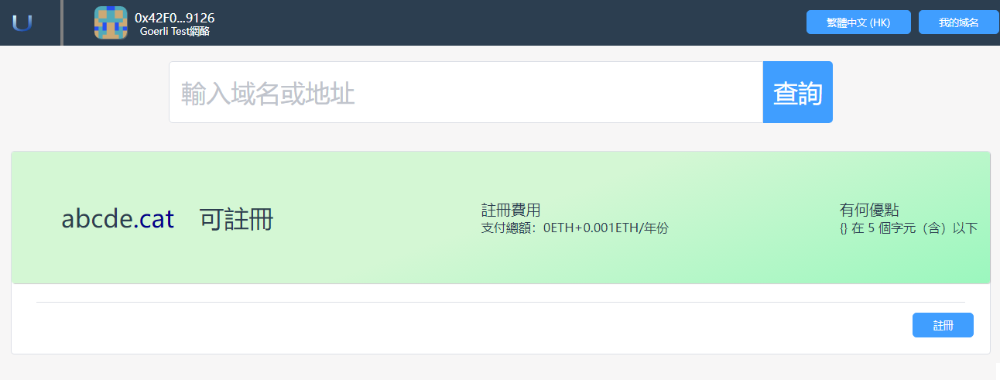

# 搜索

用戶可以搜索自己感興趣的域名，如果這些域名沒有註冊，則可以註冊。

**為了防止您感興趣的域名被別人註冊，請盡快註冊您感興趣的域名。 **

## 1.搜索所有頂級域名

### 1.1在搜索框中輸入域名進行搜索
通過搜索欄可以找到您感興趣的域名是否可以註冊。 App提供了豐富的頂級域名，供您在不同場景使用。

- 在首頁查詢輸入框中，輸入您感興趣的域名，然後點擊"查詢"按鈕。

- 您也可以在其它頁面中的搜索框中輸入感興趣的域名

### 1.2搜索結果

- 現在進入到查詢結果頁面。
 

- 在查詢結果頁面，您可以切換顯示方式，可以以列表或者條目的方式展示查詢結果。
  - 綠色背景表示該域名可以註冊，為了防止域名被別人搶注，請您盡快註冊您感興趣的域名。
  - 灰色背景表示該域名已經被別人搶注了，您只有等該域名過期後才能搶注。
  - 現在您點擊還沒有註冊的域名，進入註冊頁面。

## 2.搜索特定頂級域名

### 2.1進入特定頂級域名搜索頁面

如果您只對某個特定頂級域名感興趣，例如“.cat”，可以在首頁中點擊該頂級域名，程序會進入該頂級域名的搜索頁面。

### 2.2 搜索結果

現在進入到查詢結果頁面。

- 綠色背景表示該域名可以註冊，為了防止域名被別人搶注，請您盡快註冊您感興趣的域名。
- 灰色背景表示該域名已經被別人搶注了，您只有等該域名過期後才能搶注。
- 現在您點擊還沒有註冊的域名，進入註冊頁面。

