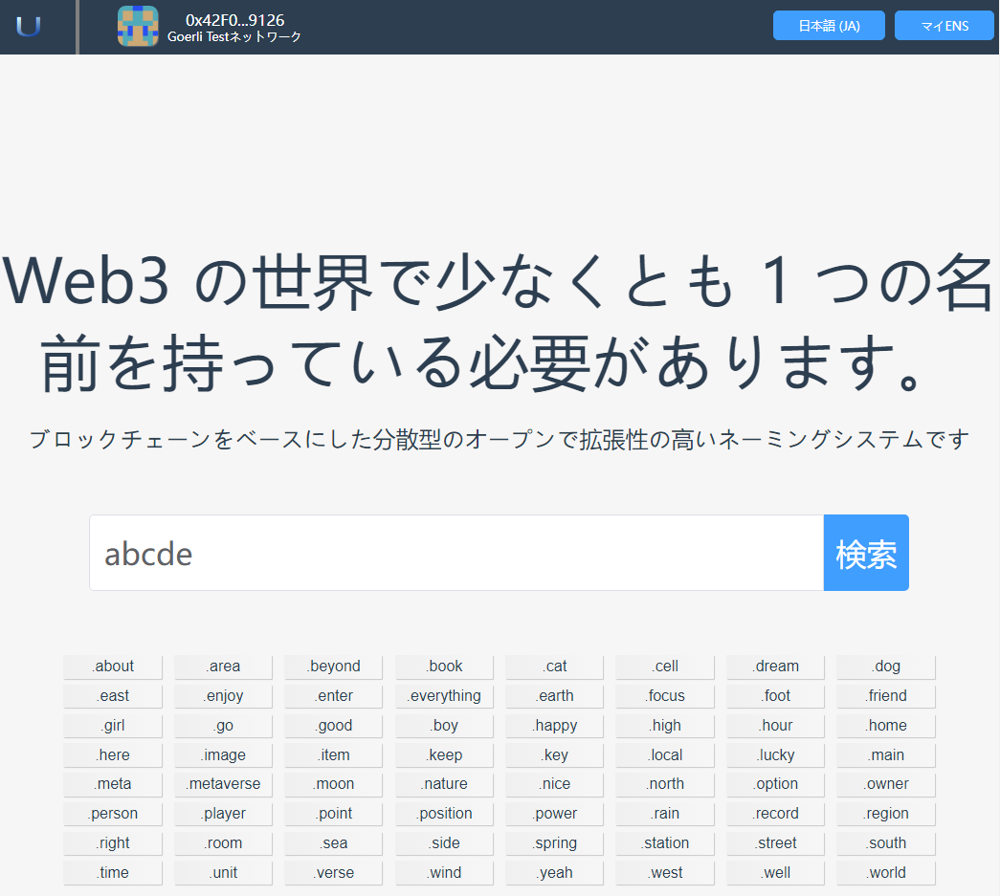
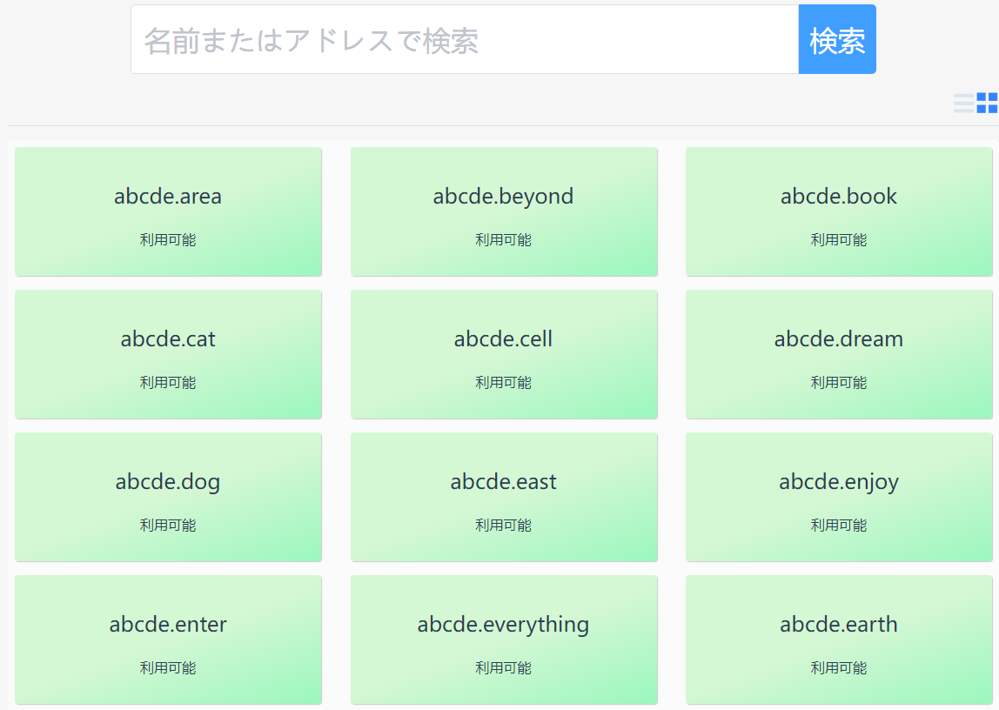
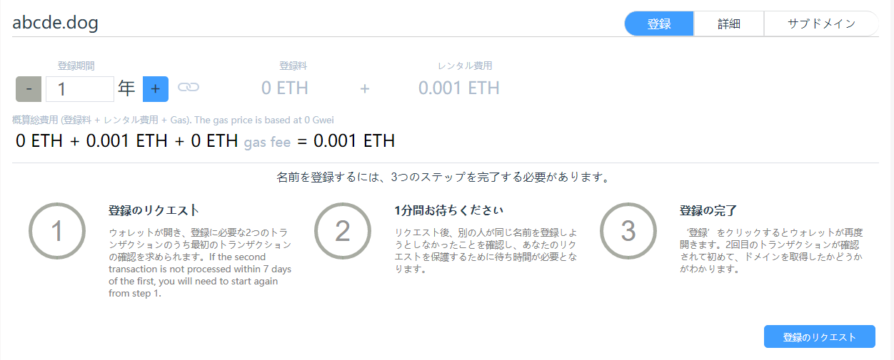
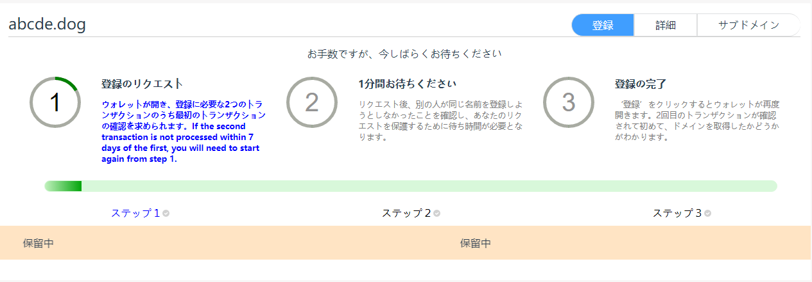
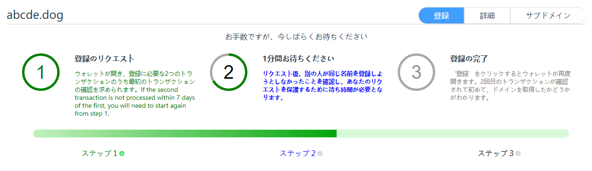
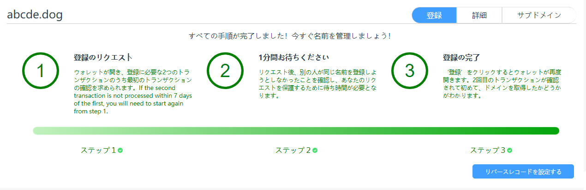

# ドメイン名登録

ドメイン名の登録は、アプリの非常に重要な部分です。ドメイン名を登録した後でのみ、そのドメイン名を使用して移管や構成ファイルなどの操作を完了することができます。

## 1. 興味のあるドメイン名を見つける

検索バーを使用して、関心のあるドメイン名が登録可能かどうかを確認してください。アプリは、さまざまなシナリオで使用できる豊富なトップレベル ドメイン名を提供します。

**ご希望のドメイン名が他人に登録されることを防ぐため、ご希望のドメイン名はお早めにご登録ください。**

- ホームページのクエリ入力ボックスに、関心のあるドメイン名を入力し、[クエリ] ボタンをクリックします。

- 次に、クエリ結果ページに移動します。

- クエリ結果ページでは、表示モードを切り替えたり、クエリ結果を一覧や項目で表示したりできます。
  ・緑色の背景は、ドメイン名が登録可能であることを意味します。他人によるドメイン名の横取りを防ぐため、ご希望のドメイン名はお早めにご登録ください。
  - 灰色の背景は、そのドメイン名が他のユーザーによって横取りされたことを意味し、ドメイン名の有効期限が切れた後にのみ横取りできます。
  - 登録されていないドメイン名をクリックして、登録ページに入ります。

## 2. ドメイン名を登録する

ENS と同様に、ドメイン名の登録には、登録の要求、1 分間の待機、登録の 3 つの手順が必要です。

### 2.1 登録のお願い

レジストリに要求を送信して、ドメイン名を登録します。
[Request Registration] ボタンをクリックすると、プログラムが Metamask インターフェイスをポップアップ表示し、ユーザーに確認を求めます。

**注：このステップでは、ユーザーが燃料費を支払う必要があります**

このステップの目的は、ドメイン名を登録することをレジストリに宣言することです。

このステップを完了してから 24 時間以内に登録しない場合は、このステップに戻って登録を再度リクエストする必要があります。そのため、ドメイン名が他人に占拠されないようにするために、この手順が完了したらできるだけ早く次の手順を実行してください。

### 2.2 1分間待ちます

他の人の要求と競合しないように、しばらく待ちます。

このステップの目的は、他の人が同じ名前を登録しようとしていないことを確認することです。また、登録要求が他の人を置き換えたり、事前登録したりしないように保護することも目的です。

### 2.3 登録

登録完了後、登録料・レンタル料をお支払い後、登録センターにて登録情報を追加してください。登録が成功すると、ドメイン名はあなたのものになり、ドメイン名を管理できるようになります。

**注：このステップでは、ユーザーが燃料費を支払う必要があります**

### 2.4 登録完了

登録完了後、逆解像度の設定が可能になります。

