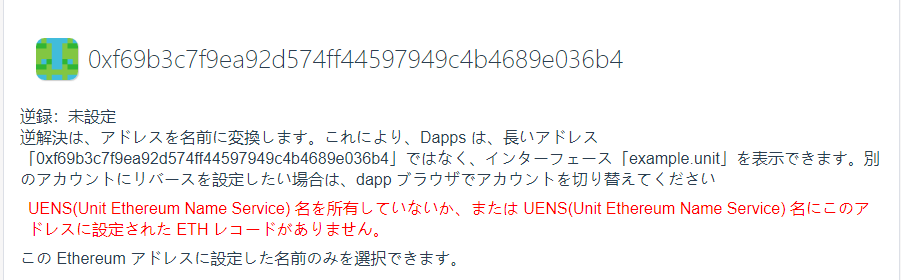
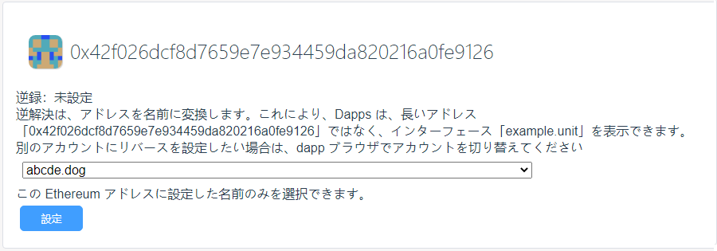

# 逆解析

インターネットと同様に、リバース リゾリューションとは、ETH アドレスからドメイン名へのマッピングを指します。

逆解析により、ETH アドレスをドメイン名に変換できます。つまり、「0xf69b3c7f9ea92d574ff44597949c4b4689e036b4」という形式の長いアドレスは、アプリでは「example.unit」として表示されます。

## ユーザーの ETH アドレスに解決されるドメイン名のみを選択できます

ユーザーがドメイン名を所有していない場合、またはドメイン名の下の ETH レコードがユーザーの ETH アドレスに設定されていない場合、下図に示すように逆引き解決レコードは設定できません。

## 逆レコードを設定する

ドメイン名を所有している場合、または特定のドメイン名の下の ETH レコードが ETH アドレスに設定されている場合、逆解決レコードを設定できます。

**注：このステップでは、ユーザーが燃料費を支払う必要があります**

ドロップダウン リスト ボックスでドメイン名を選択し、[設定] ボタンをクリックしてウォレットで確認します。

## 逆レコードを削除する

ETH アドレスの逆引きレコードを設定した後、必要に応じて逆引きレコードを削除できます。

**注：このステップでは、ユーザーが燃料費を支払う必要があります**