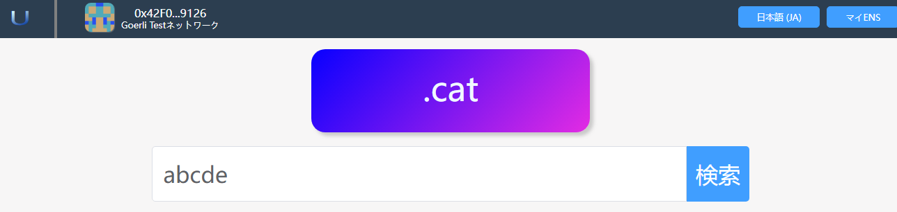
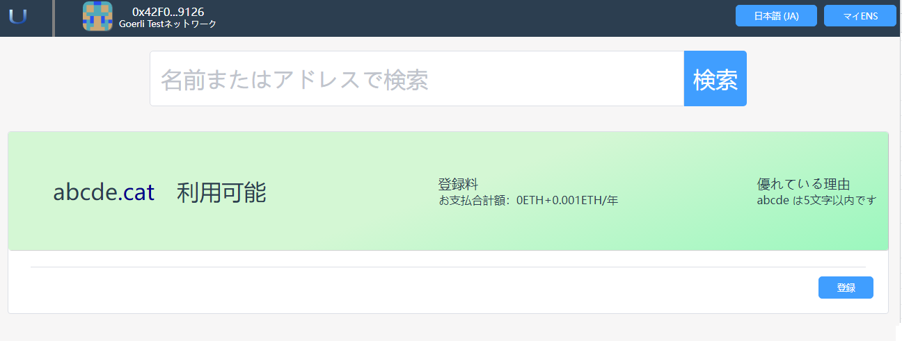

# Search

ユーザーは、興味のあるドメイン名を検索し、それらのドメイン名が登録されていない場合は、登録することができます。

**ご注意：ご希望のドメイン名が他人に登録されることを防ぐため、ご希望のドメイン名はお早めにご登録ください。**

## 1. Search all TLDs

### 1.1 検索ボックスにドメイン名を入力して検索します
検索バーを使用して、関心のあるドメイン名が登録可能かどうかを確認してください。アプリは、さまざまなシナリオで使用できる豊富なトップレベル ドメイン名を提供します。

- ホームページのクエリ入力ボックスに、関心のあるドメイン名を入力し、[クエリ] ボタンをクリックします。

- 他のページの検索ボックスに興味のあるドメイン名を入力することもできます

### 1.2search results

- クエリ結果ページに入ります。

- クエリ結果ページでは、表示モードを切り替えたり、クエリ結果を一覧や項目で表示したりできます。
  ・緑色の背景は、ドメイン名が登録可能であることを意味します。他人によるドメイン名の横取りを防ぐため、ご希望のドメイン名はお早めにご登録ください。
  - 灰色の背景は、そのドメイン名が他のユーザーによって横取りされたことを意味し、ドメイン名の有効期限が切れた後にのみ横取りできます。
  - 登録されていないドメイン名をクリックして、登録ページに入ります。

## 2. Search for a specific TLD

### 2.1 特定のトップレベル ドメイン名検索ページに入る

「.cat」などの特定のトップレベル ドメイン名のみに関心がある場合は、ホームページでトップレベル ドメイン名をクリックすると、プログラムはトップレベル ドメインの検索ページに入ります。名前。

### 2.2 Search Results

クエリ結果ページに入ります。

・緑色の背景は、ドメイン名が登録可能であることを意味します。他人によるドメイン名の横取りを防ぐため、ご希望のドメイン名はお早めにご登録ください。
- 灰色の背景は、そのドメイン名が他のユーザーによって横取りされたことを意味し、ドメイン名の有効期限が切れた後にのみ横取りできます。
- 登録されていないドメイン名をクリックして、登録ページに入ります。

