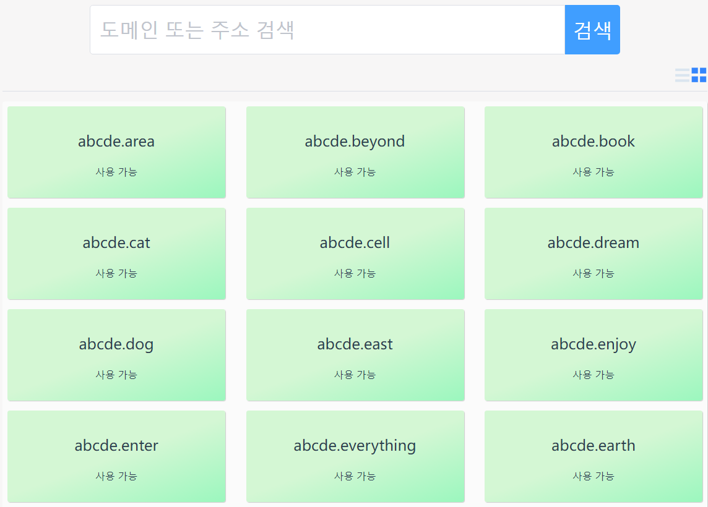

# 도메인 이름 등록

도메인 이름 등록은 앱에서 매우 중요한 부분입니다. 도메인 이름을 등록한 후에만 도메인 이름을 사용하여 전송 및 구성 파일과 같은 작업을 완료할 수 있습니다.

## 1. 관심 도메인 찾기

검색창을 사용하여 관심 있는 도메인 이름이 등록 가능한지 확인하십시오. 앱은 다양한 시나리오에서 사용할 수 있는 풍부한 최상위 도메인 이름을 제공합니다.

**관심 있는 도메인 이름이 타인에 의해 등록되는 것을 방지하기 위해 가능한 한 빨리 관심 있는 도메인 이름을 등록하십시오.**

- 홈페이지의 쿼리 입력란에 관심 있는 도메인 이름을 입력한 후 "쿼리" 버튼을 클릭합니다.

- 이제 쿼리 결과 페이지로 이동합니다.

- 쿼리 결과 페이지에서 표시 모드를 전환할 수 있으며 쿼리 결과를 목록 또는 항목 형태로 표시할 수 있습니다.
  - 녹색 배경은 도메인 이름을 등록할 수 있음을 의미합니다. 도메인 이름이 타인에게 선점되지 않도록 관심 있는 도메인 이름을 가능한 한 빨리 등록하십시오.
  - 회색 배경은 도메인 이름이 다른 사람에 의해 선점되었음을 의미하며 도메인 이름이 만료된 후에만 선점할 수 있습니다.
  - 이제 등록되지 않은 도메인 이름을 클릭하여 등록 페이지로 들어갑니다.

## 2. Register domain name

ENS와 마찬가지로 도메인 이름 등록에는 등록 요청, 1분 대기, 등록의 세 단계가 필요합니다.

### 2.1 Request for registration

도메인 이름을 등록하기 위해 레지스트리에 요청을 보냅니다.
"등록 요청" 버튼을 클릭하면 프로그램이 메타마스크 인터페이스를 팝업하여 사용자에게 확인을 요청합니다.

**Note: This step requires the user to pay for GAS fees**

이 단계의 목적은 도메인 이름을 등록할 레지스트리에 선언하는 것입니다.

이 단계를 완료한 후 24시간 이내에 등록하지 않으면 이 단계로 돌아가 등록을 다시 요청해야 합니다. 따라서 다른 사람이 귀하의 도메인 이름을 무단 점유하지 않도록 하려면 이 단계가 완료된 후 가능한 한 빨리 다음 단계를 수행하십시오.

### 2.2 1분만 기다리세요

다른 사람의 요청과 충돌하지 않도록 잠시 기다리십시오.

이 단계의 목적은 다른 사람이 동일한 이름을 등록하려고 시도하지 않도록 하고 등록 요청이 다른 사람을 대체하거나 사전 등록하지 못하도록 보호하는 것입니다.

### 2.3 등록

등록 완료 후 등록비 및 렌탈료 결제 후 등록 센터에서 등록 정보를 추가합니다. 등록이 성공적으로 완료되면 도메인 이름은 귀하에게 속하며 도메인 이름을 관리할 수 있습니다.

**참고: 이 단계에서는 사용자가 연료비를 지불해야 합니다.**

### 2.4 등록 완료

등록 완료 후 반전 해상도를 설정할 수 있습니다.

