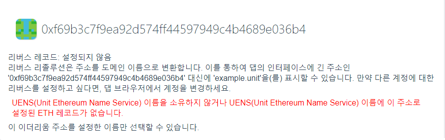
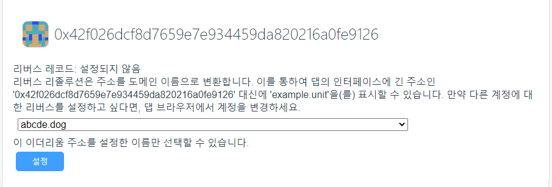

# Reverse

Similar to the Internet, reverse resolution refers to the mapping from ETH addresses to domain names.

Reverse analysis can convert the ETH address into a domain name, that is, the lengthy address in the form of "0xf69b3c7f9ea92d574ff44597949c4b4689e036b4" is displayed as "example.unit" in the App.

## Only the UENS names that point to your Ethereum account can be set

If the user does not own a domain name, or the ETH record under the domain name is not set to the user's ETH address, the reverse resolution record cannot be set, as shown in the figure below.

## Set reverse record

If you own a domain name, or the ETH record under a certain domain name is set to your ETH address, you can set reverse resolution records.

**Note: This step requires the user to pay for GAS fees**

Select a domain name in the drop-down list box, then click the "Settings" button to confirm in the wallet.

## Delete the reverse record

After you set a reverse record for an ETH address, you can delete the reverse record as needed.

**Note: This step requires the user to pay for GAS fees**