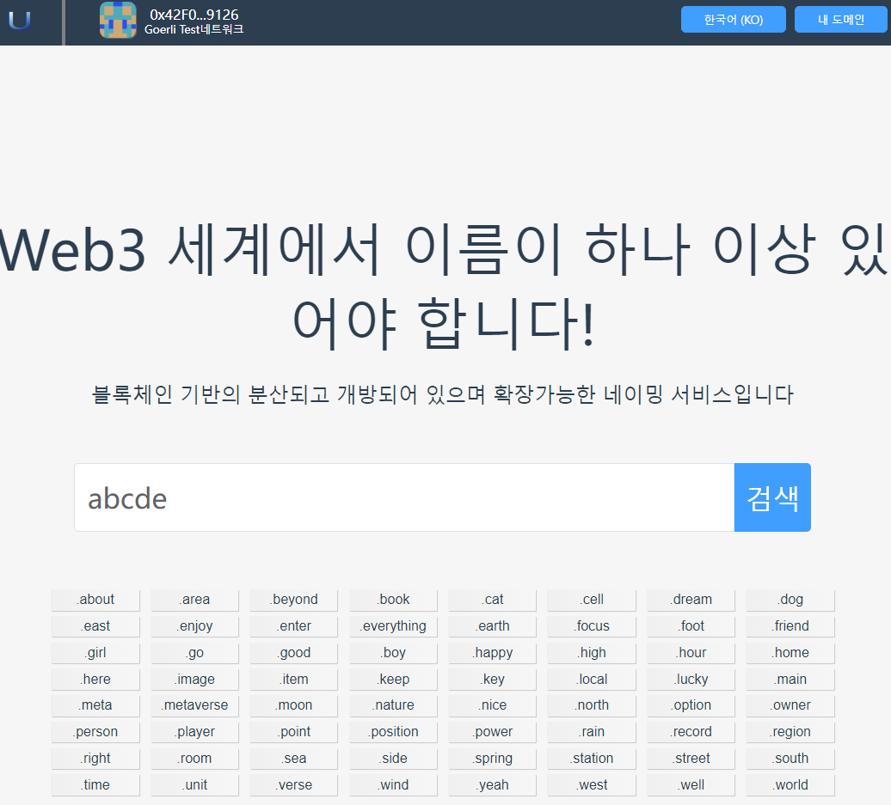
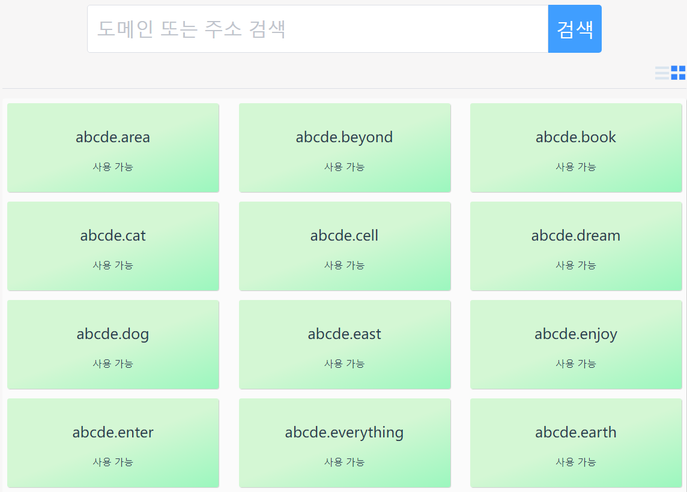
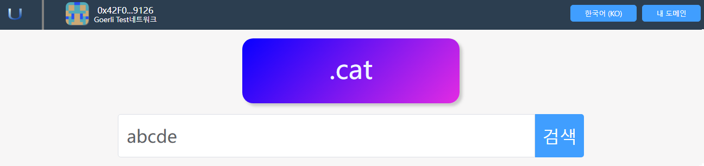
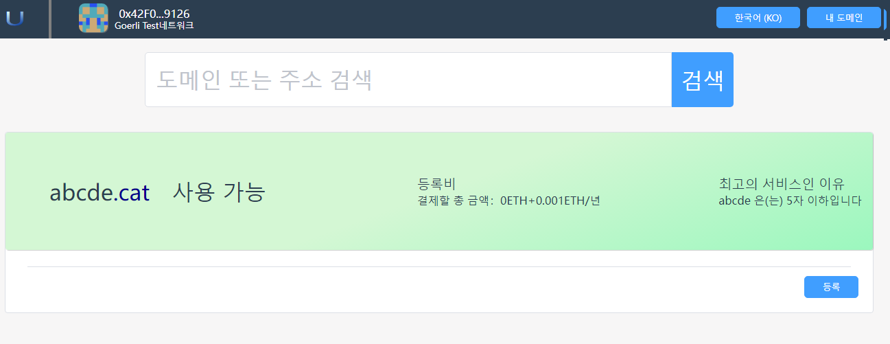

# Search

Users can search for domain names they are interested in, and if these domain names are not registered, they can register them.

**Note:In order to prevent the domain name you are interested in from being registered by others, please register the domain name you are interested in as soon as possible.**

## 1. Search all TLDs

### 1.1 Enter the domain name in the search box to search
Use the search bar to find out whether the domain name you are interested in is available for registration. App provides a wealth of top-level domain names for you to use in different scenarios.

- In the query input box on the home page, enter the domain name you are interested in, and then click the "Query" button.

- You can also enter the domain name you are interested in in the search box on other pages

### 1.2search results

- Now enter the query results page.

- On the query result page, you can switch the display mode, and you can display the query results in the form of a list or an item.
  - The green background means that the domain name can be registered. In order to prevent the domain name from being preempted by others, please register the domain name you are interested in as soon as possible.
  - A gray background means that the domain name has been preempted by others, and you can only preempt it after the domain name expires.
  - Now you click on a domain name that has not been registered to enter the registration page.

## 2. Search for a specific TLD

### 2.1 Enter the specific top-level domain name search page

If you are only interested in a specific top-level domain name, such as ".cat", you can click on the top-level domain name on the home page, and the program will enter the search page of the top-level domain name.

### 2.2 Search Results

Now enter the query results page.

- The green background means that the domain name can be registered. In order to prevent the domain name from being preempted by others, please register the domain name you are interested in as soon as possible.
- A gray background means that the domain name has been preempted by others, and you can only preempt it after the domain name expires.
- Now you click on a domain name that has not been registered to enter the registration page.

