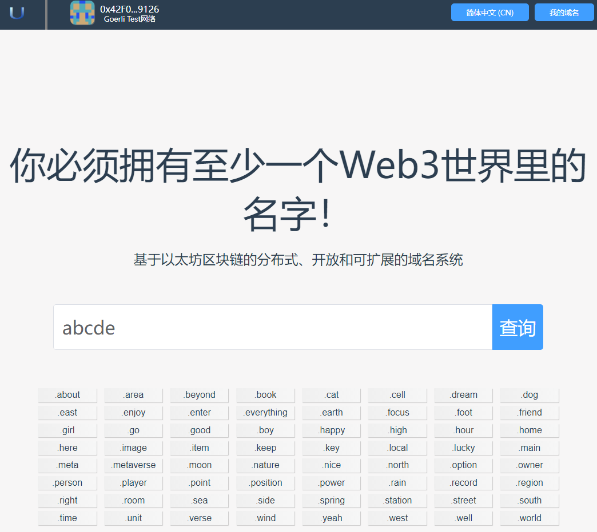

# 域名注册

域名注册是App中非常重要的一个部分，只有您注册了域名，才能够使用该域名完成转账、配置文件等操作。

## 1.找到感兴趣的域名

通过搜索栏可以找到您感兴趣的域名是否可以注册。App提供了丰富的顶级域名，供您在不同场景使用。

**为了防止您感兴趣的域名被别人注册，请尽快注册您感兴趣的域名。**

- 在首页查询输入框中，输入您感兴趣的域名，然后点击"查询"按钮。

- 现在进入到查询结果页面。
 

- 在查询结果页面，您可以切换显示方式，可以以列表或者条目的方式展示查询结果。
  - 绿色背景表示该域名可以注册，为了防止域名被别人抢注，请您尽快注册您感兴趣的域名。
  - 灰色背景表示该域名已经被别人抢注了，您只有等该域名过期后才能抢注。
  - 现在您点击还没有注册的域名，进入注册页面。

## 2.注册域名

同ENS类似，域名注册需要三个步骤：请求注册、等待一分钟和注册。

### 2.1请求注册

向注册中心发出请求，请求注册一个域名。
点击“请求注册”按钮，程序会弹出Metamask界面，要求用户进行确认。

**注意：此步需要用户支付燃料费**

此步的目的是向注册中心进行声明，告诉注册中心您想要注册一个域名。

如果该步骤完成之后的24小时内您没有进行注册，则需要回到该步骤重新开始请求注册。因此，为了确保您的域名不被别人抢注，请在该步骤完成之后尽快执行后面步骤。

### 2.2等待一分钟

等待一段时间，确保不和其他人的请求冲突。

此步目的是确保其他人没有尝试注册相同的名字，同时也是在保护您的注册请求，不会对其他人顶替或提前注册。

### 2.3注册

完成注册，在支付了注册费和租赁费等费用后，在注册中心添加注册信息。当注册成功后，此域名就属于您了，接下来您就可以对该域名进行管理。

**注意：此步需要用户支付燃料费**

### 2.4完成注册

完成注册后，可以设置反向解析。

