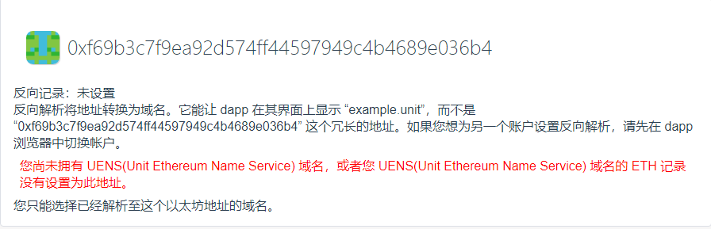
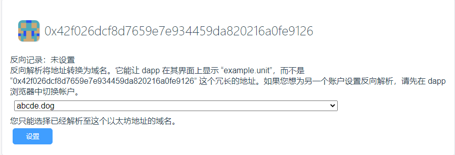

# 反向解析

同互联网类似，反向解析指的是从ETH地址到域名的映射。

反向解析能够将ETH地址转换为域名，即在App中将形如“0xf69b3c7f9ea92d574ff44597949c4b4689e036b4”的冗长地址显示为“example.unit”。

## 只能选择解析至用户ETH地址的域名

如果用户未拥有域名，或者域名下的ETH记录没有设置为用户的ETH地址，则不能设置反向解析记录，如下图所示。

## 设置反向记录
如果您拥有域名，或者某个域名下的ETH记录设置为您的ETH地址，则可以设置反向解析记录。

**注意：此步需要用户支付燃料费**

在下拉列表框中选择一个域名，然后点击“设置”按钮，在钱包中确认。

## 删除反向记录

当您为ETH地址设置了反向记录后，根据需要可以删除该反向记录。

**注意：此步需要用户支付燃料费**