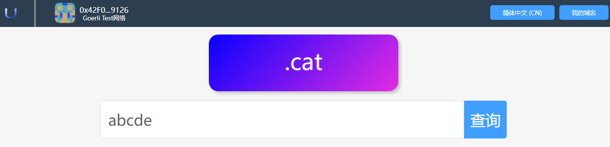
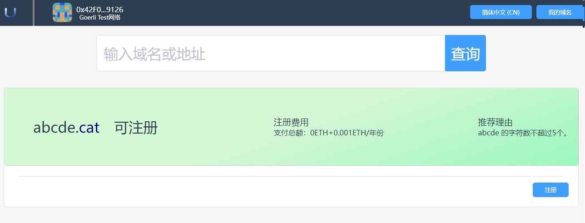

# 搜索

用户可以搜索自己感兴趣的域名，如果这些域名没有注册，则可以注册。

**为了防止您感兴趣的域名被别人注册，请尽快注册您感兴趣的域名。**

## 1.搜索所有顶级域名

### 1.1在搜索框中输入域名进行搜索
通过搜索栏可以找到您感兴趣的域名是否可以注册。App提供了丰富的顶级域名，供您在不同场景使用。

- 在首页查询输入框中，输入您感兴趣的域名，然后点击"查询"按钮。

- 您也可以在其它页面中的搜索框中输入感兴趣的域名

### 1.2搜索结果

- 现在进入到查询结果页面。
 

- 在查询结果页面，您可以切换显示方式，可以以列表或者条目的方式展示查询结果。
  - 绿色背景表示该域名可以注册，为了防止域名被别人抢注，请您尽快注册您感兴趣的域名。
  - 灰色背景表示该域名已经被别人抢注了，您只有等该域名过期后才能抢注。
  - 现在您点击还没有注册的域名，进入注册页面。

## 2.搜索特定顶级域名

### 2.1进入特定顶级域名搜索页面

如果您只对某个特定顶级域名感兴趣，例如“.cat”，可以在首页中点击该顶级域名，程序会进入该顶级域名的搜索页面。

### 2.2 搜索结果

现在进入到查询结果页面。

- 绿色背景表示该域名可以注册，为了防止域名被别人抢注，请您尽快注册您感兴趣的域名。
- 灰色背景表示该域名已经被别人抢注了，您只有等该域名过期后才能抢注。
- 现在您点击还没有注册的域名，进入注册页面。

